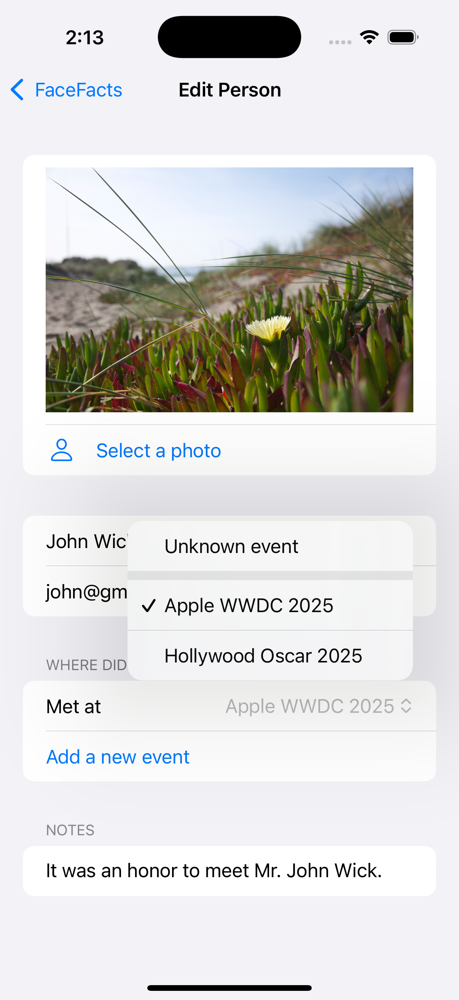
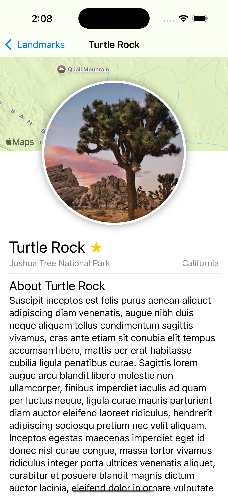

# SwiftUI Learning Repository

This repository is dedicated to learning the SwiftUI framework for building native applications for iOS, macOS, and other Apple platforms. 

This directory focuses on the fundamental concepts of the Swift programming language, which are essential prerequisites before diving into SwiftUI application development.

## Swift Programming Language Fundamentals

*   **Variables:** Declaring and using variables and constants.
*   **Operators:** Standard arithmetic, comparison, and logical operators.
*   **If-Else:** Conditional statements for branching logic.
*   **Collections:** Working with arrays, sets, and dictionaries.
*   **Functions:** Defining and calling functions.
*   **Closures:** Understanding and using closures.
*   **Optionals:** Handling the absence of a value.
*   **Structures:** Creating custom value types.
*   **Classes:** Creating custom reference types.
*   **Enumerations:** Defining custom types with a finite set of related values.
*   **Protocols:** Defining blueprints of methods, properties, and other requirements.
*   **Extensions:** Adding new functionality to existing types.
*   **Generics:** Writing flexible and reusable code.
*   **Error Handling:** Responding to and recovering from errors.
*   **Equality & Hashing:** Conforming to `Equatable` and `Hashable` protocols.
*   **Custom Operators:** Defining custom infix, prefix, postfix, and assignment operators.
*   **Async Programming:** Understanding and using `async/await` for concurrent code.

## FaceFacts: iOS App

FaceFacts is a SwiftUI-based iOS application designed to help you remember the people you meet at various events. It allows you to store essential details about individuals, including their name, email address, a personal photo, and notes. You can also create events and associate people with the specific event where you met them.

### Features

*   **Add and Manage People**: Easily add new people to your list, edit their information, or remove them.
*   **Detailed Profiles**: For each person, you can store:
    *   Name
    *   Email Address
    *   A photo from your library
    *   General notes or details
*   **Event Tracking**: Create events with a name and location to keep track of where you met each person.
*   **Search Functionality**: Quickly find people by searching for their name, email, or any detail in their notes.
*   **Sort Options**: Sort your list of people alphabetically by name (A-Z or Z-A).
*   **Data Persistence**: Your data is saved locally on your device using SwiftData.

    
    

## Landmarks: iOS and iPadOS App

Landmarks is a SwiftUI-based application for iOS and iPadOS that helps users discover and learn about famous landmarks. The app provides a list of landmarks, each with detailed information, images, and a map view showing its location.

### Features

*   **Discover Landmarks**: Browse a list of beautiful and famous landmarks.
*   **Detailed Information**: View details for each landmark, including a description, photo, and location.
*   **Interactive Map**: See the landmark's location on an interactive map.
*   **Favorites**: Mark your favorite landmarks for quick access.
*   **Category Filtering**: Filter landmarks by category, such as Lakes or Mountains.
*   **Adaptive UI**: The user interface adapts seamlessly for both iPhone and iPad layouts.

    
    
    

## NetworkingCoins: iOS App

NetworkingCoins is a SwiftUI-based iOS application that demonstrates fetching and displaying data from a network API. It lists various cryptocurrencies, showing their market rank, name, symbol, and logo.

### Features

*   **Fetch Cryptocurrency Data**: Fetches a list of coins from a remote API.
*   **Modern Concurrency**: Utilizes Swift's `async/await` for network requests.
*   **MVVM Architecture**: Implements the Model-View-ViewModel pattern for a clean separation of concerns.
*   **Asynchronous Image Loading**: Loads and displays coin logos asynchronously using `AsyncImage`.
*   **Dependency Injection**: Leverages SwiftUI's `Environment` for injecting the data service.
*   **Error Handling**: Gracefully handles and displays network errors to the user.

